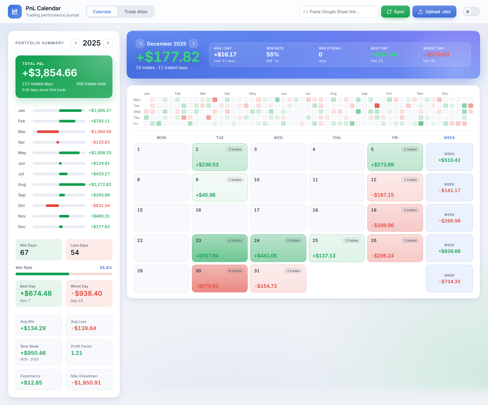
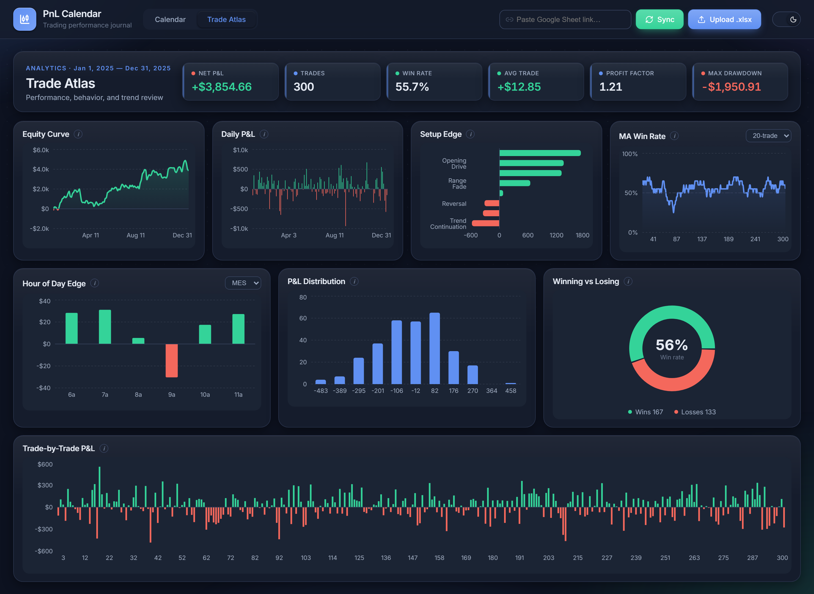

# PnL Calendar — Web

[](https://github.com/tipo0407/PnLCalendarWeb/actions/workflows/ci.yml)

A web version of the PnL Calendar trading journal, built with **React + TypeScript + Vite**.
It reads your trading workbook in the browser and renders a monthly P&L calendar, a 12-month
activity heatmap, a Portfolio Lens sidebar, and a Trade Atlas analytics dashboard.

The companion desktop app (WPF) lives in `../PnLCalendar`. The web app reuses the same data
convention: it reads **only the 3rd worksheet**, with the same column names as the desktop app.

## Screenshots

> Rendered from the bundled [`samples/Trading.sample.xlsx`](./samples/Trading.sample.xlsx) (300 fake trades across a year).

**Calendar** (light theme)



**Trade Atlas** (dark theme)



## Features

- **Calendar** — pastel P&L cells, trade counts, market-holiday badges, weekly totals, and
  month navigation
- **12-month activity heatmap** — colored by daily P&L magnitude; click any cell to jump to
  that month
- **Portfolio Lens sidebar** — total P&L, equity curve, win-rate bar, profit factor,
  expectancy, best/worst day, best week, monthly breakdown bars, and key insights
- **Trade Atlas** — equity curve, daily P&L, win/loss donut, setup edge, time-of-day edge,
  trade-by-trade P&L, P&L distribution histogram, **Leak Finder** (where money drains, ranked),
  **discipline trend**, tag insights, risk/drawdown, and key metrics
- **Day detail modal** — a per-trade breakdown for the selected day, with paste-from-clipboard
  screenshots and per-trade mistake/emotion tags
- **Weekly review** — finds your single biggest leak and exports a branded PDF report (header,
  top leaks, "change one thing", and a not-investment-advice disclaimer)
- **Local review reminders** — privacy-preserving daily-journal nudge and weekly summary
- **Light / dark theme** — toggle in the top bar; your choice is remembered
- **Accessible & fast** — focus-trapped modals, a `?` keyboard-shortcut overlay, and
  code-split vendor bundles for quick first loads

## Data sources

Three ways to load trades:

1. **Sample data** — click **Sample** (or **Explore with sample data**) for an instant demo.
2. **Upload a file** — `.xlsx`, `.xls`, or `.csv`. An **import wizard** opens so you can pick the
   worksheet and map your columns; it auto-detects common headers and dates, shows a live
   preview, and reports any rows it had to skip. You don't need a fixed layout or column order.
3. **Google Sheet link** — paste the link and click **Sync**.
   - The browser cannot carry your Google login session, so the sheet must be shared as
     **"Anyone with the link can view"**, otherwise the request returns 401.
   - In dev mode this goes through a Vite proxy (`/gsheet`) to avoid browser CORS issues.

Dates are flexible: Excel serials, `2026-06-23`, `6/23/2026`, `23-Jun-2026`, etc. Times accept
day fractions, `HH:MM`, or `9:35 AM`. Only **Date** is required to import a row.

## Workbook format

The app loads trades from a single Excel workbook (`.xlsx`). It always reads the
**3rd worksheet** (sheet index 3, i.e. the third tab) — the first two tabs can be anything
(e.g. a journal and a notes sheet). Put your trade log on the 3rd tab.

- **Row 1** must be the header row.
- **Each subsequent row** is one trade.
- A row is skipped if its `Date` cell is empty/non-numeric.
- Column **order does not matter** — columns are matched by header name (case-insensitive).
- Only the columns below are read; any extra columns are ignored.

### Columns

| Header           | Type                      | Required | Description                                            |
| ---------------- | ------------------------- | :------: | ----------------------------------------------------- |
| `Date`           | Excel date serial         |   yes    | Trade date. Must be a real Excel date, not text.      |
| `EntryTime`      | Excel time (day fraction) |    no    | Entry time of day (e.g. `0.5` = 12:00).               |
| `ExitTime`       | Excel time (day fraction) |    no    | Exit time of day.                                     |
| `NoOfDay`        | integer                   |    no    | Trade sequence number within the day (1, 2, 3 …).     |
| `Duration`       | Excel time (day fraction) |    no    | Holding time.                                         |
| `Direction`      | text                      |    no    | `Long` / `Short` (free text; pills detect long/short).|
| `Symbol`         | text                      |    no    | Instrument symbol (e.g. `MES`).                       |
| `EntryPrice`     | number                    |    no    | Entry price.                                          |
| `ExitPrice`      | number                    |    no    | Exit price.                                           |
| `Size`           | number                    |    no    | Position size / contracts.                            |
| `PL`             | number                    |    yes*  | Per-trade profit/loss. Drives every chart.            |
| `Setup`          | text                      |    no    | Strategy / setup label (used by "Setup Edge").        |
| `Reason&Emotion` | text                      |    no    | Free-text note about rationale / emotion.             |
| `APL`            | number                    |    no    | Running cumulative P&L after the trade.               |
| `Note`           | text                      |    no    | Free-text note.                                       |

\* `Date` is required for a row to be included; `PL` should be present for the analytics to be
meaningful (missing `PL` is treated as `0`).

### How dates and times are encoded

Excel stores dates and times as numbers, and this app reads those raw numbers:

- A **date** is the integer number of days since 1899-12-30 (the Excel epoch).
  Example: `2026-01-14` → `46036`.
- A **time** is the fraction of a 24-hour day.
  Example: `07:38` → `0.31806`, `12:00` → `0.5`, `00:30` → `0.02083`.

If you type dates/times normally into Google Sheets or Excel (formatted as Date / Time), they
are already stored this way — just keep the cells formatted as Date/Time, not Text.

### Example

The trade log tab (3rd sheet), as you would see it in a spreadsheet:

| Date       | EntryTime | ExitTime | NoOfDay | Duration | Direction | Symbol | EntryPrice | ExitPrice | Size | PL     | Setup     | Reason&Emotion   | APL    | Note            |
| ---------- | --------- | -------- | ------- | -------- | --------- | ------ | ---------- | --------- | ---- | ------ | --------- | ---------------- | ------ | --------------- |
| 2026-01-14 | 07:38     | 07:44    | 1       | 00:06    | Long      | MES    | 6947.75    | 6940.75   | 1    | -36.24 | Reversal  | bottom looked weak | -36.24 | waited too long |
| 2026-01-14 | 09:12     | 09:20    | 2       | 00:08    | Short     | MES    | 6131.00    | 6128.50   | 1    | 12.50  | Trend     | held the trend     | -23.74 |                 |

Trades are sorted automatically by `Date`, then `EntryTime`, then `NoOfDay`.

### Try it without your own data

The fastest way: click **Sample** in the top bar (or **Explore with sample data** on the empty
screen) to instantly load 300 fake trades — no upload, no network, all in your browser.

The same dataset is also a workbook at **[`samples/Trading.sample.xlsx`](./samples/Trading.sample.xlsx)**
(two placeholder tabs + a **`Trades`** tab) if you'd rather see the file format or upload it.
Both are produced by:

```powershell
node samples/generate-sample.cjs   # writes the .xlsx and src/data/sampleTrades.ts
```

To use a **Google Sheet** instead, copy that same structure into a sheet (any two tabs first,
then a third tab with the headers + your rows). Share it as "Anyone with the link can view"
and paste the link, then **Sync** — or keep it private and load via the local server (below).

## Development

```powershell
cd PnLCalendarWeb
npm install
npm run dev      # dev server at http://localhost:5173
npm run build    # type-check + production build
npm run lint     # ESLint
```

## Notes

Uploading an `.xlsx` works in any deployment. For private-sheet sync you need a small backend
proxy that carries your Google session.

The repo includes an optional **local server** (`server/serve.cjs`) — a dependency-free static
host that also proxies `/yahoo` (intraday candles) and `/gsheet`, serves the live workbook at
`/data/trades.xlsx`, and exposes `/api/sync` to refresh it from Google Sheets. `npm run serve`
runs it; `server/install-autostart.ps1` registers it to auto-start at logon. Paths and the sheet
id in `server/` are personal defaults — adjust them for your own setup.

## Licensing & checkout (Pro)

The app is local-first, so "Pro" is unlocked with a license key rather than a server session.
`server/api.cjs` is a dependency-free service exposing:

- `POST /api/checkout` — Stripe-ready stub. Returns a Checkout URL when `STRIPE_SECRET_KEY`
  is configured; otherwise tells the client to use a license key.
- `POST /api/license/verify` `{ key }` — validates an HMAC-signed key (constant-time);
  the demo key `PNLCAL-PRO-DEMO` always passes. The client verifies online and falls back to
  an offline format check, so activation works even without the API.
- `POST /api/license/issue` `{ payload }` — **admin-only** (set `ADMIN_TOKEN`, send it as the
  `x-admin-token` header). Mints a key bound to an order/email payload.

**Post-payment flow:** Stripe Checkout → webhook → your handler calls `/api/license/issue` with
the order id → email the returned key to the buyer → they paste it into Settings/Plans to
activate. Issue keys offline with `npm run license:gen` (or `node server/api.cjs --gen <payload>`).
Run the API standalone with `npm run api` (port 8788); `server/serve.cjs` also serves these routes.

## Deploy

The app is static and the server is dependency-free Node, so deployment is simple.

**Static hosting (frontend only):** `npm run build` and serve `dist/` on any static host
(Netlify, Vercel, GitHub Pages, S3). License activation falls back to the offline format check
when `/api/*` isn't present, so the journal works fully without a backend.

**Docker (frontend + API + proxies):**

```sh
docker build -t pnlcalendar .
docker run -p 4173:4173 \
  -e LICENSE_SECRET=change-me \
  -e ADMIN_TOKEN=some-admin-token \
  # -e STRIPE_SECRET_KEY=sk_live_...   # enables real checkout
  pnlcalendar
```

The image builds the frontend and serves it via `server/serve.cjs` on port 4173, including
`/api/checkout` and `/api/license/*`. Environment variables:

| Var | Purpose |
| --- | --- |
| `PORT` | Server port (default 4173) |
| `LICENSE_SECRET` | HMAC secret for signing/verifying license keys |
| `AUTH_SECRET` | HMAC secret for account auth tokens (falls back to `LICENSE_SECRET`) |
| `ADMIN_TOKEN` | Enables `/api/license/issue`; sent as the `x-admin-token` header |
| `STRIPE_SECRET_KEY` | When set, `/api/checkout` returns a real Checkout URL |
| `STRIPE_WEBHOOK_SECRET` | When set, `/api/stripe/webhook` verifies signatures |
| `USERS_FILE` / `BLOB_DIR` | Where accounts and cloud blobs persist |

**docker-compose** (persists accounts + cloud data in a volume):

```sh
cp .env.example .env   # edit secrets
docker compose up -d
```

The compose file mounts a `pnlcal-data` volume at `/data` for `USERS_FILE` and `BLOB_DIR`,
and includes a `/api/health` healthcheck.

Note: the Google-Sheet `/api/sync` refresh is Windows-only (it runs a `.bat`); it is inert in the
Linux container and the app degrades gracefully (uploads and pasted Google Sheet links still work).

### Ops & monitoring

The server exposes unauthenticated health endpoints for load balancers / uptime checks:

- `GET /api/health` → `{ ok: true, uptime: <seconds> }`
- `GET /api/version` → `{ version, node, commit }` (`commit` comes from the `GIT_COMMIT` env var)

Point your monitor at `/api/health` and treat a non-200 or `ok:false` as unhealthy.

### Security

- The static server sends `X-Content-Type-Options: nosniff`, `X-Frame-Options: DENY`,
  `Referrer-Policy: no-referrer` and a restrictive `Content-Security-Policy`.
- Auth endpoints are rate-limited per IP (default 20/min, configurable via `AUTH_RATE_MAX`),
  and a wrong-password streak locks an email+IP for 15 minutes.
- Passwords are salted + scrypt-hashed; sessions are HMAC-signed bearer tokens (30-day TTL);
  password-reset tokens are purpose-scoped and can't be used as auth tokens.
- Health probes also answer at `/api/healthz`.

### Reverse proxy (nginx)

In production, terminate TLS at a reverse proxy and forward to the Node server on
`127.0.0.1:4173`. A minimal nginx site:

```nginx
server {
  listen 443 ssl http2;
  server_name journal.example.com;

  ssl_certificate     /etc/letsencrypt/live/journal.example.com/fullchain.pem;
  ssl_certificate_key /etc/letsencrypt/live/journal.example.com/privkey.pem;

  # Cache hashed static assets aggressively; never cache the API.
  location /assets/ {
    proxy_pass http://127.0.0.1:4173;
    expires 30d;
    add_header Cache-Control "public, immutable";
  }

  location / {
    proxy_pass http://127.0.0.1:4173;
    proxy_set_header Host              $host;
    proxy_set_header X-Real-IP         $remote_addr;
    proxy_set_header X-Forwarded-For   $proxy_add_x_forwarded_for;
    proxy_set_header X-Forwarded-Proto $scheme;
  }
}

# Redirect plain HTTP to HTTPS.
server {
  listen 80;
  server_name journal.example.com;
  return 301 https://$host$request_uri;
}
```

The app's CSP and `X-Frame-Options` headers are emitted by the Node server, so the
proxy doesn't need to add them. Make sure the proxy forwards `X-Forwarded-For` so the
per-IP auth rate-limiter and login lockout see the real client address.

### Sessions, rotation & revocation

Auth tokens are stateless HMAC bearer tokens (30-day TTL) carrying a per-user
`tokenVersion` claim. To **revoke every active session** for a user — after a
password change, a suspected leak, or on demand — bump that version:

- Changing a password or completing a reset rotates `tokenVersion` automatically,
  so old tokens stop validating.
- `POST /api/auth/signout-all` (or **Settings → Account → Sign out everywhere**)
  rotates it on demand.
- `verifySession` re-checks the version on every protected request (`/api/auth/me`,
  `/api/sync/*`), so revocation takes effect immediately without a token blacklist.

Rotate `AUTH_SECRET` to invalidate **all** sessions across all users at once (e.g.
during incident response); every existing token fails signature verification.

**Storage backend.** Accounts and cloud blobs go through a pluggable seam
(`server/store.cjs`, selected via the `STORE` env var). The default file store writes
to `USERS_FILE` / `BLOB_DIR`; back these with a mounted volume (see docker-compose)
and include them in your backup rotation. Swap in a different store implementation to
move sessions/blobs into a database without touching the auth or sync handlers.

## Tech stack

- React 19 + TypeScript + Vite
- [SheetJS](https://sheetjs.com/) (`xlsx`) for workbook parsing
- [Recharts](https://recharts.org/) for charts

## License

[MIT](./LICENSE)

> **Commercialization note (undecided).** If this becomes a paid product, the MIT license
> lets anyone use, modify, sell, and re-license the code — and an already-published MIT
> version can't be retroactively revoked. Before charging for it, decide whether to keep it
> MIT (open-core), relicense future work as proprietary, or make the repo private. This is a
> deliberate decision for the owner to make — the current LICENSE is intentionally left
> unchanged until then.
